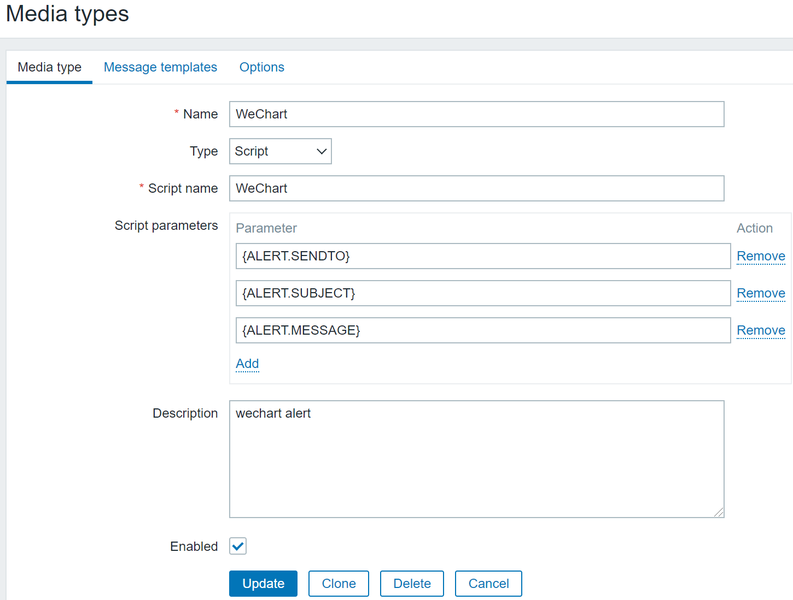
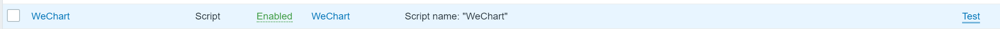
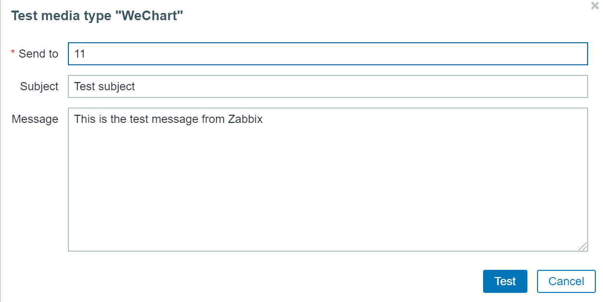
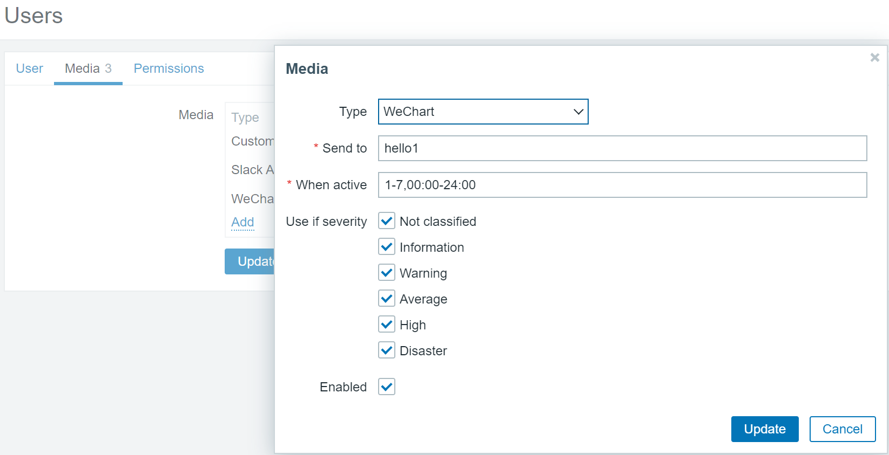

Zabbix WeChart AlertScript
========================

About
-----
This is simply a Bash script that uses the custom alert script.

#### Versions

This works with Zabbix 4.x or higher version!

Installation
------------

### The script itself

This [`WeChart` script] needs to be placed in the `AlertScriptsPath` directory that is specified within the Zabbix servers' configuration file (`zabbix_server.conf`) and must be executable by the user running the zabbix_server binary (usually "zabbix") on the Zabbix server:

	[root@zabbix ~]# grep AlertScriptsPath /etc/zabbix/zabbix_server.conf
	### Option: AlertScriptsPath
	AlertScriptsPath=/usr/local/share/zabbix/alertscripts

	[root@zabbix ~]# ls -lh /usr/local/share/zabbix/alertscripts/WeChart
	-rwxr-xr-x 1 root root 1.4K Dec 27 16:25 /usr/local/share/zabbix/alertscripts/WeChart

If you do change `AlertScriptsPath` (or any other values) within `zabbix_server.conf`, a restart of the Zabbix server software is required.

Configuration
-------------
###Zabbix web interface add alert media,The following:

* **Name**: WeChart
* **Type**: Script
* **Script name**: WeChart

* **Send to**: Fill in any string.

